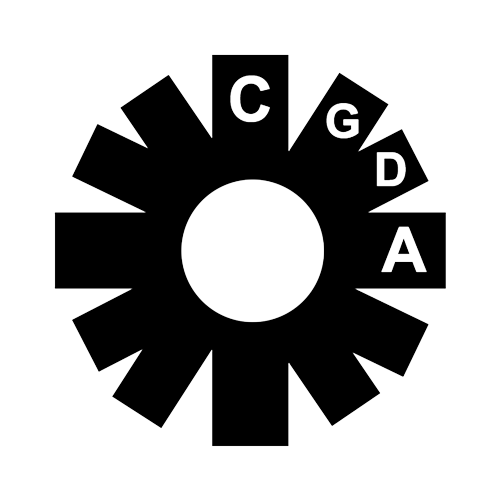

<h1>END USER LICENSE AGREEMENT</h1>

<strong>Last  updated&nbsp;March 02, 2022</strong>

CGDA&nbsp;is licensed to You (End-User) by&nbsp;CGDA, (&quot;<strong>Licensor</strong>&quot;), for use only under the terms  of this License Agreement. 

By downloading the Licensed  Application from&nbsp;Google's software distribution platform (&quot;Play  Store&quot;), and any update thereto (as permitted by this License Agreement),  You indicate that You agree to be bound by all of the terms and conditions of  this License Agreement, and that You accept this License Agreement.&nbsp;Play  Store is&nbsp;referred to in this License Agreement as “<strong>Services</strong>.” 

The parties of this License Agreement  acknowledge that the Services are not a Party to this License Agreement and are  not bound by any provisions or obligations with regard to the Licensed  Application, such as warranty, liability, maintenance and support  thereof.&nbsp;CGDA, not the Services, is solely responsible for the Licensed  Application and the content thereof. 

This License  Agreement may not provide for usage rules for the Licensed Application that are  in conflict with the latest&nbsp;<a href="https://play.google.com/intl/en_US/about/play-terms/" target="_blank">Google Play Terms of Service</a>&nbsp;(opens in a new tab)&nbsp;(&quot;<strong>Usage  Rules</strong>&quot;).&nbsp;CGDA&nbsp;acknowledges that it had the opportunity to  review the Usage Rules and this License Agreement is not conflicting with them.

CGDA&nbsp;when  purchased or downloaded through the Services, is licensed to You for use only  under the terms of this License Agreement. The Licensor reserves all rights not  expressly granted to You.&nbsp;CGDA&nbsp;is to be used on devices that operate  with&nbsp;Google's operating system (&quot;Android&quot;).

<h2>TABLE OF CONTENTS</h2>
<ol>
  <li><a href="#application">THE APPLICATION</a></li>
  <li><a href="#scope">SCOPE  OF LICENSE</a></li>
  <li><a href="#requirements">TECHNICAL REQUIREMENTS</a></li>
  <li><a href="#nosupport">NO  MAINTENANCE AND SUPPORT</a></li>
  <li><a href="#datause">USE  OF DATA</a></li>
  <li><a href="#ugc">USER-GENERATED CONTRIBUTIONS</a></li>
  <li><a href="#contribution">CONTRIBUTION LICENSE</a></li>
  <li><a href="#liability">LIABILITY</a></li>
  <li><a href="#warranty">WARRANTY</a></li>
  <li><a href="#productclaims">PRODUCT CLAIMS</a></li>
  <li><a href="#compliance">LEGAL COMPLIANCE</a></li>
  <li><a href="#contact">CONTACT INFORMATION</a></li>
  <li><a href="#termination">TERMINATION</a></li>
  <li><a href="#thirdparty">THIRD-PARTY TERMS OF AGREEMENTS AND BENEFICIARY</a></li>
  <li><a href="#ipr">INTELLECTUAL PROPERTY RIGHTS</a></li>
  <li><a href="#law">APPLICABLE LAW</a></li>
  <li><a href="#misc">MISCELLANEOUS</a></li>
</ol>

<h2 id="application">1.&nbsp;THE APPLICATION</h2>

CGDA&nbsp;(&quot;<strong>Licensed  Application</strong>&quot;) is a piece  of software created to&nbsp;facilitate song writing and spark creativity&nbsp;—  and customized for&nbsp;Android&nbsp;mobile devices (&quot;<strong>Devices</strong>&quot;). It is used to&nbsp;view the  chords in each musical key as well as common major and minor chord  progressions. 

Furthermore, it is used  to&nbsp;provide inspiration by generating a random chord progression..

The Licensed  Application is not tailored to comply with industry-specific regulations  (Health Insurance Portability and Accountability Act (HIPAA), Federal  Information Security Management Act (FISMA), etc.), so if your interactions  would be subjected to such laws, you may not use this Licensed Application. You  may not use the Licensed Application in a way that would violate the  Gramm-Leach-Bliley Act (GLBA). 

<h2 id="scope">2. SCOPE OF LICENSE</h2>

2.1 &nbsp;This  license will also govern any updates of the Licensed Application provided by  Licensor that replace, repair, and/or supplement the first Licensed  Application, unless a separate license is provided for such update, in which  case the terms of that new license will govern.

2.2 &nbsp;You may  not reverse engineer, translate, disassemble, integrate, decompile, remove,  modify, combine, create derivative works or updates of, adapt, or attempt to  derive the source code of the Licensed Application, or any part thereof (except  with&nbsp;CGDA's prior written consent).

2.3 &nbsp;You may  not copy (excluding when expressly authorized by this license and the Usage  Rules) or alter the Licensed Application or portions thereof. You may create  and store copies only on devices that You own or control for backup keeping  under the terms of this license, the Usage Rules, and any other terms and  conditions that apply to the device or software used. You may not remove any  intellectual property notices. You acknowledge that no unauthorized third  parties may gain access to these copies at any time. If you sell your Devices  to a third party, you must remove the Licensed Application from the Devices  before doing so.

2.4  &nbsp;Violations of the obligations mentioned above, as well as the attempt of  such infringement, may be subject to prosecution and damages.

2.5 &nbsp;Licensor  reserves the right to modify the terms and conditions of licensing.

2.6 &nbsp;Nothing  in this license should be interpreted to restrict third-party terms. When using  the Licensed Application, You must ensure that You comply with applicable  third-party terms and conditions.

<h2 id="requirements">3. TECHNICAL REQUIREMENTS</h2>

3.1 &nbsp;The  Licensed Application requires a firmware version&nbsp;1.0.0 or higher. Licensor  recommends using the latest version of the firmware.

3.2 &nbsp;Licensor  reserves the right to modify the technical specifications as it sees  appropriate at any time.

<h2 id="nosupport">4. NO MAINTENANCE OR SUPPORT</h2>

4.1  &nbsp;CGDA&nbsp;is not obligated, expressed or implied, to provide any  maintenance, technical or other support for the Licensed Application.

4.2  &nbsp;CGDA&nbsp;and the End-User acknowledge that the Services have no  obligation whatsoever to furnish any maintenance and support services with  respect to the Licensed Application. 

<h2 id="datause">5. USE OF DATA</h2>

You acknowledge  that Licensor will be able to access and adjust Your downloaded Licensed  Application content and Your personal information, and that Licensor's use of  such material and information is subject to Your legal  id="nosupport"agreements with Licensor  and Licensor's privacy policy:&nbsp;https://tyhsimms.github.io/CGDA-privacy-policy/.

You acknowledge  that the Licensor may periodically collect and use technical data and related  information about your device, system, and application software, and  peripherals, offer product support, facilitate the software updates, and for  purposes of providing other services to you (if any) related to the Licensed  Application. Licensor may also use this information to improve its products or  to provide services or technologies to you, as long as it is in a form that  does not personally identify you. 

<h2 id="ugc">6. USER-GENERATED CONTRIBUTIONS</h2>

The Licensed  Application does not offer users to submit or post content. We may provide you  with the opportunity to create, submit, post, display, transmit, perform,  publish, distribute, or broadcast content and materials to us or in the  Licensed Application, including but not limited to text, writings, video,  audio, photographs, graphics, comments, suggestions, or personal information or  other material (collectively, &quot;Contributions&quot;). Contributions may be  viewable by other users of the Licensed Application and through third-party  websites or applications. As such, any Contributions you transmit may be  treated in accordance with the Licensed Application Privacy Policy. When you  create or make available any Contributions, you thereby represent and warrant that:

<ol>
  <li>The creation,  distribution, transmission, public display, or performance, and the accessing,  downloading, or copying of your Contributions do not and will not infringe the  proprietary rights, including but not limited to the copyright, patent, trademark,  trade secret, or moral rights of any third party. </li>
  <li>You are the creator  and owner of or have the necessary licenses, rights, consents, releases, and  permissions to use and to authorize us, the Licensed Application, and other  users of the Licensed Application to use your Contributions in any manner  contemplated by the Licensed Application and this License Agreement. </li>
  <li>You have the  written consent, release, and/or permission of each and every identifiable  individual person in your Contributions to use the name or likeness or each and  every such identifiable individual person to enable inclusion and use of your  Contributions in any manner contemplated by the Licensed Application and this  License Agreement. </li>
  <li>Your Contributions  are not false, inaccurate, or misleading. </li>
  <li>Your Contributions  are not unsolicited or unauthorized advertising, promotional materials, pyramid  schemes, chain letters, spam, mass mailings, or other forms of solicitation. </li>
  <li>Your Contributions  are not obscene, lewd, lascivious, filthy, violent, harassing, libelous,  slanderous, or otherwise objectionable (as determined by us). </li>
  <li>Your Contributions  do not ridicule, mock, disparage, intimidate, or abuse anyone. </li>
  <li>Your Contributions  are not used to harass or threaten (in the legal sense of those terms) any  other person and to promote violence against a specific person or class of  people. </li>
  <li>Your Contributions  do not violate any applicable law, regulation, or rule. </li>
  <li>Your Contributions  do not violate the privacy or publicity rights of any third party. </li>
  <li>Your Contributions  do not violate any applicable law concerning child pornography, or otherwise  intended to protect the health or well-being of minors. </li>
  <li>Your Contributions  do not include any offensive comments that are connected to race, national  origin, gender, sexual preference, or physical handicap. </li>
  <li>Your Contributions  do not otherwise violate, or link to material that violates, any provision of  this License Agreement, or any applicable law or regulation. </li>
</ol>

Any use of the Licensed  Application in violation of the foregoing violates this License Agreement and  may result in, among other things, termination or suspension of your rights to  use the Licensed Application. 

<h2 id="contribution">7. CONTRIBUTION LICENSE</h2>

You agree that we  may access, store, process, and use any information and personal data that you  provide following the terms of the Privacy Policy and your choices (including  settings). 

By submitting  suggestions of other feedback regarding the Licensed Application, you agree  that we can use and share such feedback for any purpose without compensation to  you. 

We do not assert  any ownership over your Contributions. You retain full ownership of all of your  Contributions and any intellectual property rights or other proprietary rights  associated with your Contributions. We are not liable for any statements or representations  in your Contributions provided by you in any area in the Licensed Application.  You are solely responsible for your Contributions to the Licensed Application  and you expressly agree to exonerate us from any and all responsibility and to  refrain from any legal action against us regarding your Contributions. 

<h2 id="liability">8. LIABILITY</h2>

8.1  &nbsp;Licensor's responsibility in the case of violation of obligations and  tort shall be limited to intent and gross negligence. Only in case of a breach  of essential contractual duties (cardinal obligations), Licensor shall also be  liable in case of slight negligence. In any case, liability shall be limited to  the foreseeable, contractually typical damages. The limitation mentioned above  does not apply to injuries to life, limb, or health.

8.2 &nbsp;Licensor  takes no accountability or responsibility for any damages caused due to a  breach of duties according to Section 2 of this License Agreement. To avoid  data loss, You are required to make use of backup functions of the Licensed  Application to the extent allowed by applicable third-party terms and  conditions of use. You are aware that in case of alterations or manipulations  of the Licensed Application, You will not have access to the Licensed  Application.

<h2 id="warranty">9. WARRANTY</h2>

9.1 &nbsp;Licensor  warrants that the Licensed Application is free of spyware, trojan horses,  viruses, or any other malware at the time of Your download. Licensor warrants  that the Licensed Application works as described in the user documentation.

9.2 &nbsp;No  warranty is provided for the Licensed Application that is not executable on the  device, that has been unauthorizedly modified, handled inappropriately or  culpably, combined or installed with inappropriate hardware or software, used  with inappropriate accessories, regardless if by Yourself or by third parties,  or if there are any other reasons outside of&nbsp;CGDA's sphere of influence  that affect the executability of the Licensed Application.

9.3 &nbsp;You are  required to inspect the Licensed Application immediately after installing it  and notify&nbsp;CGDA&nbsp;about issues discovered without delay by email  provided in&nbsp;<a href="#productclaims">Product Claims</a>. The defect report will be  taken into consideration and further investigated if it has been emailed within  a period of&nbsp;90&nbsp;days after discovery.

9.4 &nbsp;If we  confirm that the Licensed Application is defective,&nbsp;CGDA&nbsp;reserves a  choice to remedy the situation either by means of solving the defect or  substitute delivery.

9.5&nbsp;&nbsp;In the event of any failure of the  Licensed Application to conform to any applicable warranty, You may notify the  Services Store Operator, and Your Licensed Application purchase price will be  refunded to You. To the maximum extent permitted by applicable law, the  Services Store Operator will have no other warranty obligation whatsoever with  respect to the Licensed Application, and any other losses, claims, damages,  liabilities, expenses, and costs attributable to any negligence to adhere to  any warranty. 

9.6&nbsp;&nbsp;If the user is an  entrepreneur, any claim based on faults expires after a statutory period of  limitation amounting to twelve (12) months after the Licensed Application was  made available to the user. The statutory periods of limitation given by law  apply for users who are consumers.  
  &nbsp;&nbsp;&nbsp;

<h2 id="productclaims">10. PRODUCT CLAIMS</h2>

CGDA&nbsp;and the  End-User acknowledge  that&nbsp;CGDA, and not the Services, is responsible for addressing any claims  of the End-User or any third party relating to the Licensed Application or the  End-User’s possession and/or use of that Licensed Application, including, but  not limited to: 

<ol type="rom">
  <li>product liability claims; </li>
  <li>any claim that the Licensed Application fails to conform to any  applicable legal or regulatory requirement; and </li>
  <li>claims arising under consumer protection, privacy, or similar  legislation. </li>
</ol>

<h2 id="compliance">11. LEGAL COMPLIANCE</h2>

You represent and  warrant that You are not located in a country that is subject to a US  Government embargo, or that has been designated by the US Government as a  &quot;terrorist supporting&quot; country; and that You are not listed on any US  Government list of prohibited or restricted parties. 

<h2 id="contact">12. CONTACT INFORMATION</h2>

For general inquiries, complaints,  questions or claims concerning the Licensed Application, please contact:

  
CGDA  
  cgda.app@gmail.com 

<h2 id="termination">13. TERMINATION</h2>

The license is valid until terminated  by&nbsp;CGDA&nbsp;or by You. Your rights under this license will terminate  automatically and without notice from&nbsp;CGDA&nbsp;if You fail to adhere to  any term(s) of this license. Upon License termination, You shall stop all use  of the Licensed Application, and destroy all copies, full or partial, of the  Licensed Application.

<h2 id="thirdparty">14. THIRD-PARTY TERMS OF AGREEMENTS AND BENEFICIARY</h2>

CGDA&nbsp;represents  and warrants that&nbsp;CGDA&nbsp;will comply with applicable third-party terms  of agreement when using Licensed Application. 

In Accordance with Section 9 of the  &quot;Instructions for Minimum Terms of Developer's End-User License  Agreement,&quot;&nbsp;Google's&nbsp;subsidiaries shall be third-party beneficiaries  of this End User License Agreement and — upon Your acceptance of the terms and  conditions of this License Agreement,&nbsp;Google&nbsp;will have the right (and  will be deemed to have accepted the right) to enforce this End User License  Agreement against You as a third-party beneficiary thereof. 

<h2 id="ipr">15. INTELLECTUAL PROPERTY RIGHTS</h2>

CGDA&nbsp;and the End-User  acknowledge that, in the event of any third-party claim that the Licensed  Application or the End-User's possession and use of that Licensed Application  infringes on the third party's intellectual property rights,&nbsp;CGDA, and not  the Services, will be solely responsible for the investigation, defense,  settlement, and discharge or any such intellectual property infringement  claims. 

<h2 id="law">16. APPLICABLE LAW</h2>

This License Agreement is governed by  the laws of&nbsp;Canada&nbsp;excluding its conflicts of law rules. 

<h2 id="misc">17. MISCELLANEOUS</h2>

17.1&nbsp;&nbsp;If any of the terms of  this agreement should be or become invalid, the validity of the remaining  provisions shall not be affected. Invalid terms will be replaced by valid ones  formulated in a way that will achieve the primary purpose.

17.2&nbsp;&nbsp;Collateral agreements,  changes and amendments are only valid if laid down in writing. The preceding  clause can only be waived in writing.

These terms of use  were created using Termly's&nbsp;<a href="https://termly.io/products/terms-and-conditions-generator">Terms and Conditions Generator</a>.

